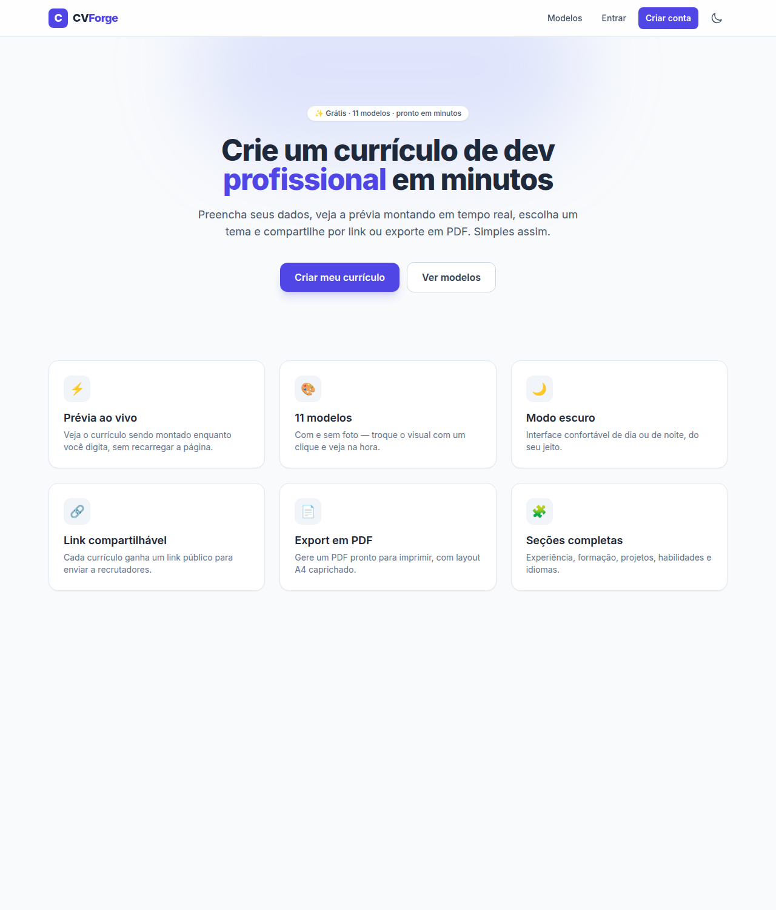
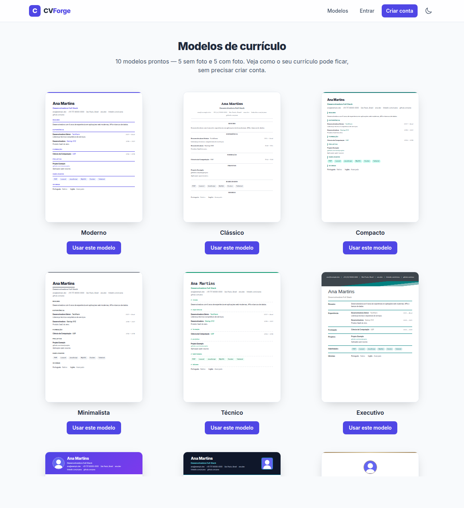
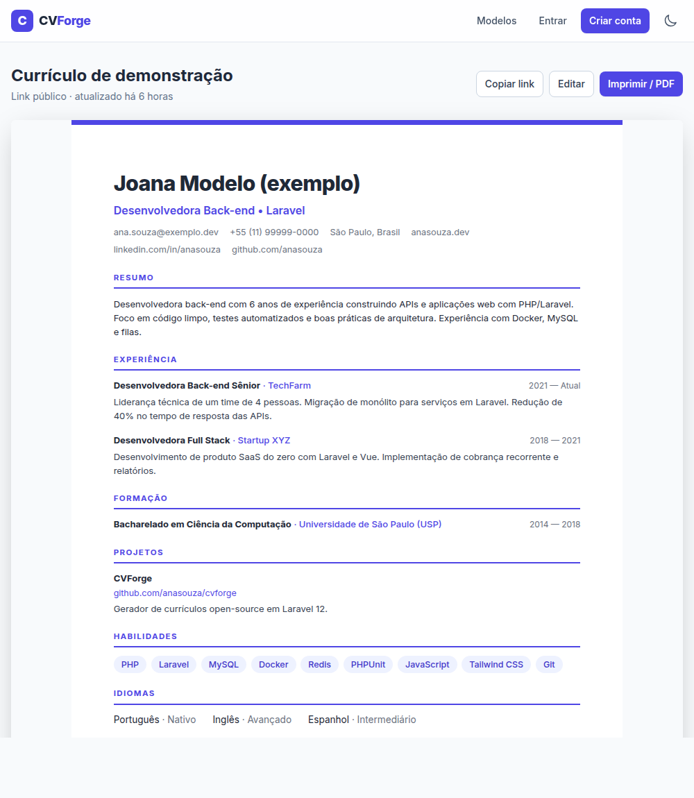
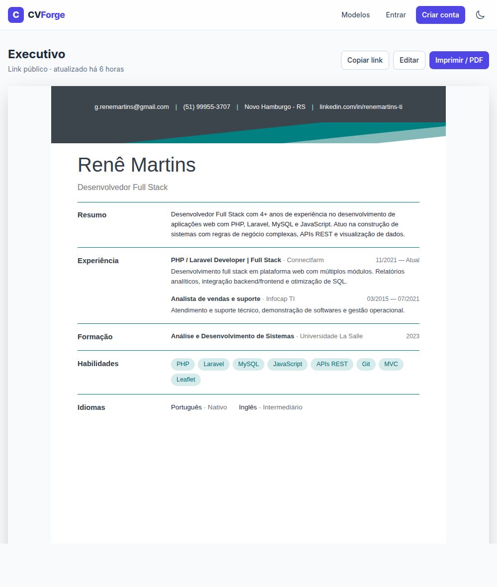

# CVForge

> Gerador de currículos para desenvolvedores — monte, pré-visualize em tempo real, escolha um modelo e compartilhe por link ou PDF.


[](https://github.com/ReneMartins1983/CVForge/actions/workflows/ci.yml)

🌐 **Demo:** _(em breve)_ · guia de publicação em [`docs/DEPLOY-RENDER.md`](docs/DEPLOY-RENDER.md)

O **CVForge** é uma aplicação web onde a pessoa cria uma conta, monta seu currículo
em um editor com **pré-visualização ao vivo** e publica em um **link compartilhável**.
São **11 modelos** (com e sem foto), modo escuro e exportação para PDF.

## 📸 Telas

| Início | Galeria de modelos |
| --- | --- |
|  |  |

| Modelo Moderno | Modelo Executivo |
| --- | --- |
|  |  |

## ✨ Funcionalidades

- 🔐 **Contas de usuário** — cada pessoa gerencia seus próprios currículos.
- ⚡ **Editor com prévia ao vivo** — o currículo é montado enquanto você digita.
- 🧩 **Seções completas** — dados pessoais, resumo, experiência, formação, habilidades, projetos e idiomas (todas repetíveis).
- 🎨 **11 modelos** — 6 sem foto (Moderno, Clássico, Compacto, Minimalista, Técnico, Executivo) e 5 com foto (Sidebar, Banner, Elegante, Cartão, Corporativo).
- 🖼️ **Upload de foto de perfil** nos modelos que a utilizam.
- 🔗 **Link público compartilhável** (`/r/{slug}`) para enviar a recrutadores.
- 📄 **Exportação em PDF / impressão** com layout A4 dedicado.
- 🌙 **Modo escuro** persistido no navegador.

## 🛠️ Stack

| Camada      | Tecnologia                                   |
| ----------- | -------------------------------------------- |
| Backend     | Laravel 12 · PHP 8.3                          |
| Banco       | MySQL 8.4                                     |
| Frontend    | Blade · Tailwind CSS 3 · Alpine.js · Vite     |
| Auth        | Laravel Breeze                                |
| Ambiente    | Docker (PHP-FPM, Nginx, MySQL, Node 20)       |
| Testes      | PHPUnit (36 testes)                           |

## 🏗️ Arquitetura

- **Currículos** são guardados com os dados em uma coluna **JSON** e um **slug** curto para o link público.
- O **documento do currículo** (`.cv`) tem CSS próprio (independente do Tailwind), garantindo fidelidade idêntica na **tela, na impressão e no PDF**.
- A **interface** (editor, navegação, modo escuro) usa Tailwind; a reatividade do editor é feita com **Alpine.js** sem necessidade de SPA.
- **Posse** é garantida no servidor: só o dono edita/remove; o link público continua aberto a todos.

## 🚀 Como rodar

Pré-requisitos: **Docker** e **Docker Compose**.

```bash
# 1. Ambiente
cp .env.example .env

# 2. Subir a imagem da aplicação (PHP 8.3 + Composer)
UID=$(id -u) GID=$(id -g) docker compose build app

# 3. Dependências PHP
docker compose run --rm app composer install

# 4. Subir a stack (app + nginx + mysql)
docker compose up -d

# 5. Chave, banco e dados de exemplo
docker compose exec app php artisan key:generate
docker compose exec app php artisan migrate --seed
docker compose exec app php artisan storage:link

# 6. Assets (Node 20 / Vite)
docker compose run --rm node npm install
docker compose run --rm node npm run build
```

Acesse **http://localhost:8000**. Crie sua conta em `/register` e comece em `/builder`.
Há um currículo de exemplo público em **`/r/exemplo1`**.

### Rotas

| Rota                  | Acesso  | Descrição                            |
| --------------------- | ------- | ------------------------------------ |
| `/`                   | público | Landing page                         |
| `/login`, `/register` | público | Autenticação                         |
| `/builder`            | logado  | Criar um currículo                   |
| `/builder/{slug}`     | dono    | Editar um currículo                  |
| `/resumes`            | logado  | Seus currículos                      |
| `/profile`            | logado  | Perfil do usuário                    |
| `/r/{slug}`           | público | Página pública (link compartilhável) |
| `/r/{slug}/print`     | público | Versão para impressão / PDF          |

## 🧪 Testes

```bash
docker compose exec app php artisan test
```

## 📦 Banco de dados

O schema é versionado em **migrations** e os dados de exemplo em um **seeder** —
não há dump `.sql`: `php artisan migrate --seed` recria tudo. Em produção o MySQL
roda como serviço Docker com volume persistente.

## 📄 Licença

MIT.
